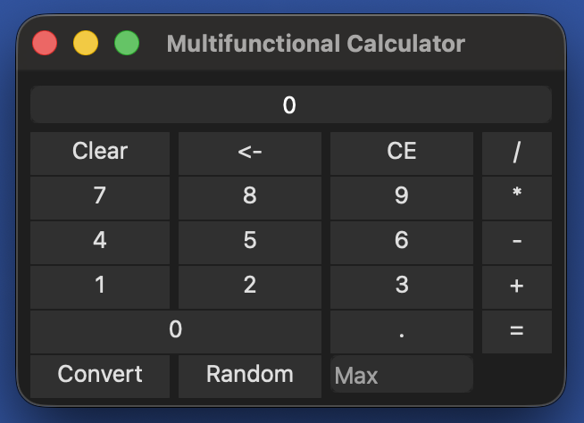

= Calculator Project
:toc:
:icons: font
:source-highlighter: coderay
:revnumber: 1.0
:revdate: 2025-09-24

== Author
Giovanni Daniel Mendez Sanchez (B54354)

== Overview
This project implements a cross-platform calculator using **C++** and **Qt Widgets**.
It provides a graphical user interface (`UICalculator`) and a calculation engine
(`Engine`) separated into distinct modules for clarity and maintainability.

== Features
* **Basic arithmetic**: Addition, subtraction, multiplication, division.
* **Base conversion**:
** Decimal (Dec)
** Hexadecimal (Hex)
** Octal (Oct)
** Binary (Bin)
* **Random number generation**: Produces a random integer (0–999999).
* **Keyboard input support**:
** Digits (0–9)
** Operators (+, −, ×, ÷)
** Equals (= or Enter)
** Escape (clear)
** Backspace (delete one character)
* **Chained operations**: Allows evaluating expressions step by step, just like
a handheld calculator.
* **UI built with Qt**:
** Digit buttons (0–9)
** Operator buttons (+, −, ×, ÷, =)
** Utility buttons (Clr, Back)
** Base conversion buttons (Dec, Hex, Oct, Bin)
** Random (Rnd) button

== Project Structure
* `src/engine.h` / `src/engine.cpp` ::
  Core calculation engine. Holds operands, operator, and provides arithmetic and
  conversion operations.
* `src/UICalculator.h` / `src/UICalculator.cpp` ::
  Main UI window implemented with Qt Widgets. Manages layout, display, buttons,
  and connects them to the engine.
* `src/main.cpp` ::
  Application entry point. Initializes Qt, constructs and shows the calculator
  window, and starts the event loop.

== Build Instructions

=== Prerequisites
* CMake (>=3.15 recommended)
* C++17 capable compiler
* Qt6 (Widgets module)
* Visual Studio Code with extensions:
** *CMake Tools*
** *C/C++* (Microsoft)
** (Optional) *Qt VS Tools* if you want better Qt integration

=== macOS (with Homebrew)
[source,shell]
----
brew install cmake qt
----

=== Linux (Ubuntu/Debian example)
[source,shell]
----
sudo apt update
sudo apt install build-essential cmake qt6-base-dev qt6-tools-dev
----

=== Windows
1. Install **CMake** (https://cmake.org/download/).
2. Install **Qt6** (via the Qt Online Installer).
3. Install **Visual Studio 2022** (Community edition is enough) with *Desktop development with C++* workload.
4. In VS Code, make sure you have the *CMake Tools* and *C/C++* extensions enabled.

=== Build
[source,shell]
----
cmake -S . -B build
cmake --build build
----

=== Run
[source,shell]
----
./build/calculator
----
*Note:* On Windows the executable will be `build\\Debug\\calculator.exe` or `build\\Release\\calculator.exe` depending on configuration.

== Usage
* Launch the application.
* Enter numbers using either the digit buttons or the keyboard.
* Press an operator (+, −, ×, ÷) to set the operation.
* Enter the second number and press `=` (or Enter key) to evaluate.
* Use `Dec`, `Hex`, `Oct`, or `Bin` to convert the current number to that base.
* Use `Rnd` to generate a random number.

* Use `Clr` to reset the calculator or `Back` to remove the last character.

== Video Demostration
The following video demonstrates the calculator in action and what you will see in the debug window

video::VideoEjemplo.mov[options="controls",width=640,height=360]

== License
This project is provided for educational purposes by Giovanni Daniel Mendez Sanchez (B54354). Extend and adapt as needed.
